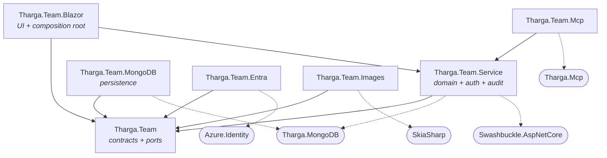
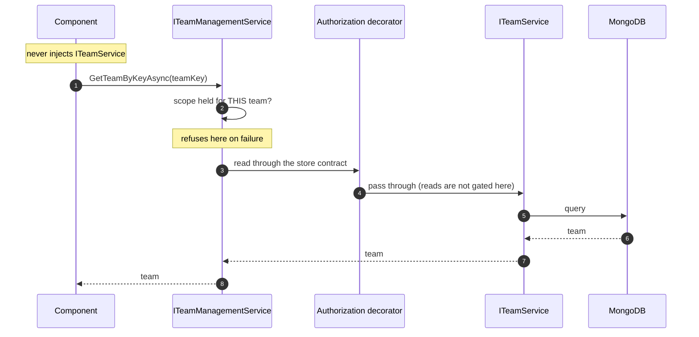

# Architecture

How the packages fit together, and where a request goes.

> This describes the structure **as it is today**, verified against the project files — not a target. Where
> something is awkward, it says so rather than describing the shape it is heading towards.

## The packages

| Package | Role | Why it is separate |
|---|---|---|
| `Tharga.Team` | Contracts, domain models, authorization primitives, and the storage seam a host implements | Nothing server-side. The one package a browser client can take cleanly |
| `Tharga.Team.Blazor` | UI components **and** the server composition root | Two roles in one package — see below |
| `Tharga.Team.Service` | Domain services, authorization decorators, audit, API-key authentication, controllers | Server-side |
| `Tharga.Team.MongoDB` | MongoDB persistence | — |
| `Tharga.Team.Entra` | Directory adapter | Keeps **`Azure.Identity`** off consumers who do not use Entra |
| `Tharga.Team.Images` | Image processing for icons | Keeps **`SkiaSharp`** and its native binaries off consumers who do not resize images |
| `Tharga.Team.Mcp` | Team-backed bridge for MCP | Opt-in protocol surface; keeps **`Tharga.Mcp`** off consumers with no agent surface |

Three of those exist purely to quarantine a dependency. That is the test a package has to pass here: a
hosting boundary, a dependency quarantine, or an opt-in protocol surface.

## Reference graph

Solid arrows are project references; dotted arrows are the third-party packages that matter when deciding
what a deployment carries.

### What the graph tells you

**`Tharga.Team` is the only package a WebAssembly client can take cleanly.** It references nothing
server-side, which is what makes the contracts and claim types usable in a browser.

**`Tharga.Team.Blazor` is not WASM-clean today**, despite being a UI package. It references
`Tharga.Team.Service`, which references `Tharga.MongoDB` and `Swashbuckle.AspNetCore` *directly* — so taking
the components also takes the MongoDB driver and the OpenAPI generator. The components themselves are
hosting-agnostic; the packaging is not. Splitting the server composition root out of this package is the
change that would fix it.

**`Tharga.Team.MongoDB` is not a quarantine.** `Tharga.Team.Service` references `Tharga.MongoDB` itself, so
the persistence package keeps nothing out of anyone's graph — unlike `Entra` and `Images`, which each keep a
real dependency off consumers who do not want it.

**The storage seam is in `Tharga.Team`, not in `Tharga.Team.MongoDB`.** `TeamServiceBase` and
`UserServiceBase` declare abstract members that a host implements; `Tharga.Team.MongoDB` is one
implementation of them. A second store would implement the same seam without touching the packaging.

## Where a request goes

A team-scoped read from a component, under server-hosted Blazor. The two things worth following are **which
interface the component holds** and **where the scope is checked**.

The claims that authorization reads are built earlier, once per authenticating request, by the server claims
transformation — and that path reads team data through `ITeamService` **without** a scope check, because the
scope it would check is the one being constructed. That is why the store contract is deliberately unchecked.

## Where authorization actually happens

Two rules follow from the sequence above, and both are easy to get wrong:

- **A component, controller or MCP provider injects a gated facet** — `ITeamManagementService` and its
  siblings — **never `ITeamService`.** The store contract is marked `[EditorBrowsable(Never)]` and an
  architecture test fails the build if anything in this repo injects it from a first-level surface.
- **Reads on `TeamManagementService` are enforced in the method bodies**, not by the `[RequireScope]`
  attributes on the interface. Those attributes are enforced by `ScopeProxy<T>`, which only applies when a
  service is registered through `AddTeamService` / `AddSystemService` — and the team facets are not. Adding a
  read there and relying on the attribute gets you no enforcement.

The full rules, including the three service categories and what each is marked by, are in the
[implementation guide](implementation-guide.md).

## Hosting

Server-hosted Blazor calls the domain in-process, through the same gate a remote transport would. **Which
host you run is a deployment choice, not a security one** — the enforcement point does not move.

There is no HTTP client package and no operation-level REST surface today. A WebAssembly or desktop client
would need both, and they are deliberately not built on spec: the operation surface needs a real client to be
designed against.
